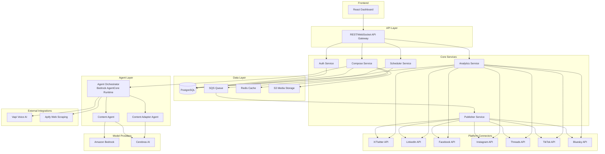
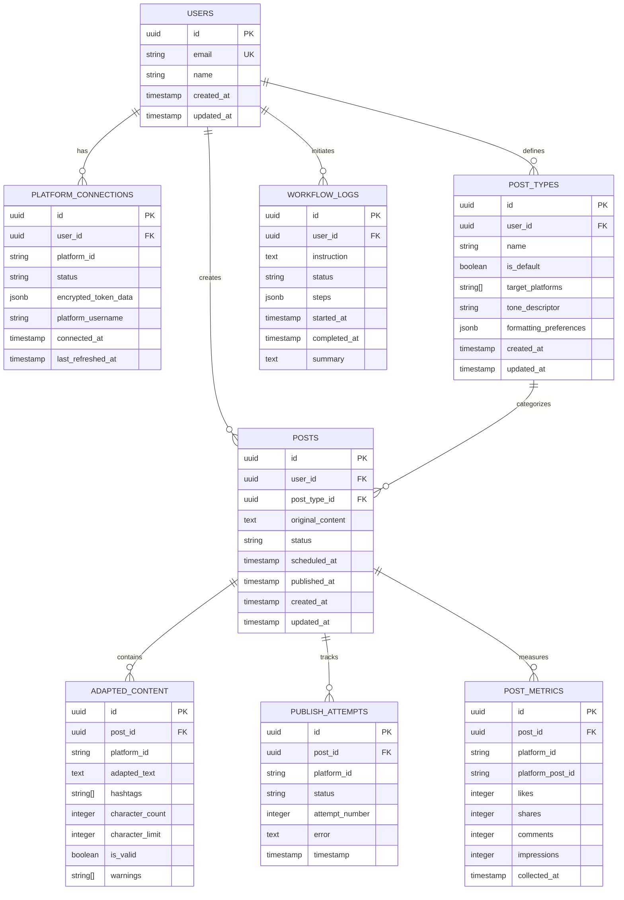

# Design Document: Social Media Manager

## Overview

The Social Media Manager is an AI-native, agentic application that provides a unified multi-platform dashboard for composing, scheduling, and publishing content across seven major social networks: X, LinkedIn, Facebook, Instagram, Threads, TikTok, and Bluesky.

The system leverages agentic AI patterns (planning, tool use, reflection) powered by Amazon Bedrock AgentCore for orchestration and Cerebras AI for fast inference. External integrations include Vapi for voice-based content input and Apify for trend research via web scraping. All infrastructure is defined as code using Pulumi with TypeScript.

### Key Design Decisions

1. **TypeScript/Node.js backend** — Aligns with Pulumi IaC language choice and provides strong typing for complex agent workflows.
2. **React frontend** — Industry-standard for dashboard applications with responsive design requirements.
3. **Amazon Bedrock AgentCore Runtime** — Provides serverless, session-isolated agent execution with built-in tool orchestration and up to 8-hour execution windows for complex workflows.
4. **Cerebras AI as primary inference provider** — Offers OpenAI-compatible API with extremely fast inference speeds (up to 18x faster than GPU-based solutions), ideal for real-time content generation. Available via AWS Marketplace.
5. **Event-driven architecture** — Decouples scheduling, publishing, and analytics collection for resilience and scalability.
6. **Pulumi TypeScript IaC** — Infrastructure definitions alongside application code in the same language, enabling type-safe resource management.

## Architecture



### Architecture Rationale

- **Separation of concerns**: Each service handles a specific domain (auth, compose, schedule, publish, analytics), enabling independent scaling and deployment.
- **Agent Layer isolation**: The Agent Orchestrator runs in Bedrock AgentCore Runtime with session isolation, keeping agent execution secure and independent from the core application services.
- **Queue-based publishing**: SQS decouples scheduling from publishing, providing retry semantics and preventing platform rate-limit cascades.
- **Cache layer**: Redis caches model responses and platform tokens to reduce paid API usage (Requirement 8.4).

## Components and Interfaces

### 1. Platform Connector

Responsible for authenticating with and publishing to each social platform's API.

```typescript
interface PlatformConnector {
  platformId: PlatformId;
  authenticate(credentials: OAuthCredentials): Promise<AuthResult>;
  refreshToken(token: TokenData): Promise<TokenData>;
  publish(content: PlatformContent): Promise<PublishResult>;
  getMetrics(postId: string): Promise<EngagementMetrics>;
  validateConnection(): Promise<ConnectionStatus>;
}

type PlatformId = 'x' | 'linkedin' | 'facebook' | 'instagram' | 'threads' | 'tiktok' | 'bluesky';

interface AuthResult {
  success: boolean;
  token?: TokenData;
  error?: string;
}

interface TokenData {
  accessToken: string;
  refreshToken: string;
  expiresAt: Date;
  platformId: PlatformId;
}
```

### 2. Platform Router

Routes content to appropriate platforms based on post type configuration.

```typescript
interface PlatformRouter {
  route(content: DraftContent, postType: PostType): RoutingDecision;
  getTargetPlatforms(postTypeId: string): PlatformId[];
}

interface RoutingDecision {
  targetPlatforms: PlatformId[];
  postType: PostType;
  content: DraftContent;
}
```

### 3. Content Agent

AI agent for content generation using configured model providers.

```typescript
interface ContentAgent {
  generate(prompt: ContentPrompt): Promise<GeneratedContent>;
  suggestFromHistory(context: HistoricalContext): Promise<ContentSuggestion[]>;
}

interface ContentPrompt {
  userInput: string;
  postType: PostType;
  targetPlatforms: PlatformId[];
  voiceInput?: VoiceTranscription;
  trendContext?: TrendData;
}

interface GeneratedContent {
  drafts: PlatformDraft[];
  modelUsed: string;
  providerId: 'bedrock' | 'cerebras';
}
```

### 4. Content Adapter

Transforms content into platform-specific formats.

```typescript
interface ContentAdapter {
  adapt(content: string, platform: PlatformId, postType: PostType): AdaptedContent;
  validate(content: AdaptedContent): ValidationResult;
}

interface AdaptedContent {
  platform: PlatformId;
  text: string;
  hashtags?: string[];
  mediaRequirements?: MediaRequirement[];
  characterCount: number;
  characterLimit: number;
  isValid: boolean;
  warnings: string[];
}

interface PlatformConstraints {
  characterLimit: number;
  mediaFormats: string[];
  hashtagStrategy: 'inline' | 'separated' | 'none';
  linkFormat: 'raw' | 'embedded-card' | 'preview';
}
```

### 5. Agent Orchestrator

Central coordinator managing complex multi-step AI workflows.

```typescript
interface AgentOrchestrator {
  executeWorkflow(request: WorkflowRequest): Promise<WorkflowResult>;
  getExecutionLog(workflowId: string): ExecutionLog;
}

interface WorkflowRequest {
  userId: string;
  instruction: string;
  context: WorkflowContext;
}

interface WorkflowResult {
  workflowId: string;
  status: 'completed' | 'partial' | 'failed';
  steps: ExecutionStep[];
  summary: string;
  artifacts: WorkflowArtifact[];
}

interface ExecutionStep {
  stepId: string;
  type: 'plan' | 'tool_use' | 'reflection';
  description: string;
  input: unknown;
  output: unknown;
  status: 'success' | 'failed' | 'retried';
  timestamp: Date;
  durationMs: number;
}
```

### 6. Scheduler

Manages content queue and time-based publishing.

```typescript
interface Scheduler {
  schedule(post: ScheduledPost): Promise<ScheduleResult>;
  cancel(scheduleId: string): Promise<void>;
  reschedule(scheduleId: string, newTime: Date): Promise<ScheduleResult>;
  getUpcoming(userId: string, range: DateRange): Promise<ScheduledPost[]>;
}

interface ScheduledPost {
  id: string;
  userId: string;
  content: AdaptedContent[];
  targetPlatforms: PlatformId[];
  scheduledAt: Date;
  status: 'pending' | 'publishing' | 'published' | 'failed' | 'cancelled';
  retryCount: number;
  maxRetries: number;
}
```

### 7. Analytics Collector

Gathers and aggregates engagement metrics across platforms.

```typescript
interface AnalyticsCollector {
  collectMetrics(postId: string): Promise<AggregateMetrics>;
  getAggregateView(userId: string, dateRange: DateRange): Promise<DashboardMetrics>;
  getPostBreakdown(postId: string): Promise<PlatformMetricBreakdown[]>;
}

interface EngagementMetrics {
  likes: number;
  shares: number;
  comments: number;
  impressions: number;
  platform: PlatformId;
  collectedAt: Date;
}

interface AggregateMetrics {
  totalLikes: number;
  totalShares: number;
  totalComments: number;
  totalImpressions: number;
  byPlatform: Map<PlatformId, EngagementMetrics>;
}
```

### 8. External Tool Integrations

```typescript
interface VapiIntegration {
  transcribeVoiceInput(audioStream: ReadableStream): Promise<VoiceTranscription>;
  isConfigured(): boolean;
}

interface ApifyIntegration {
  researchTrends(query: TrendQuery): Promise<TrendData>;
  scrapeCompetitorContent(targets: string[]): Promise<CompetitorContent[]>;
  isConfigured(): boolean;
}

interface VoiceTranscription {
  text: string;
  confidence: number;
  language: string;
}

interface TrendData {
  topics: TrendTopic[];
  hashtags: string[];
  collectedAt: Date;
}
```

## Data Models

### User and Authentication

```typescript
interface User {
  id: string;
  email: string;
  name: string;
  createdAt: Date;
  updatedAt: Date;
}

interface PlatformConnection {
  id: string;
  userId: string;
  platformId: PlatformId;
  status: 'active' | 'expired' | 'disconnected' | 'error';
  tokenData: EncryptedTokenData;
  platformUsername: string;
  connectedAt: Date;
  lastRefreshedAt: Date;
}
```

### Post Types

```typescript
interface PostType {
  id: string;
  userId: string;
  name: string;
  isDefault: boolean;
  targetPlatforms: PlatformId[];
  toneDescriptor: string;
  formattingPreferences: FormattingPreferences;
  createdAt: Date;
  updatedAt: Date;
}

interface FormattingPreferences {
  useEmojis: boolean;
  hashtagStyle: 'aggressive' | 'moderate' | 'minimal';
  linkPlacement: 'inline' | 'end';
  mentionStyle: 'formal' | 'casual';
}
```

### Content and Posts

```typescript
interface Post {
  id: string;
  userId: string;
  postTypeId: string;
  originalContent: string;
  adaptedContent: Map<PlatformId, AdaptedContent>;
  status: 'draft' | 'scheduled' | 'publishing' | 'published' | 'failed';
  scheduledAt?: Date;
  publishedAt?: Date;
  platformPostIds: Map<PlatformId, string>;
  createdAt: Date;
  updatedAt: Date;
}

interface PublishAttempt {
  id: string;
  postId: string;
  platformId: PlatformId;
  status: 'success' | 'failed';
  attemptNumber: number;
  error?: string;
  timestamp: Date;
}
```

### Agent Workflow Logs

```typescript
interface WorkflowLog {
  id: string;
  userId: string;
  instruction: string;
  status: 'running' | 'completed' | 'failed';
  steps: ExecutionStep[];
  startedAt: Date;
  completedAt?: Date;
  summary?: string;
}
```

### Analytics

```typescript
interface PostMetrics {
  id: string;
  postId: string;
  platformId: PlatformId;
  platformPostId: string;
  likes: number;
  shares: number;
  comments: number;
  impressions: number;
  collectedAt: Date;
}
```

### Database Schema (PostgreSQL)




## Correctness Properties

*A property is a characteristic or behavior that should hold true across all valid executions of a system — essentially, a formal statement about what the system should do. Properties serve as the bridge between human-readable specifications and machine-verifiable correctness guarantees.*

### Property 1: Token refresh before publish

*For any* platform connection with an expired token, when a publish operation is initiated, the system SHALL attempt a token refresh before executing the publish request.

**Validates: Requirements 1.4**

### Property 2: Routing exclusivity

*For any* post type configuration and any content, the Platform_Router SHALL route content to exactly the set of platforms configured for that post type — no more, no fewer.

**Validates: Requirements 2.3**

### Property 3: Platform character limit enforcement

*For any* content string and any target platform, the Content_Adapter's output text SHALL have a character count less than or equal to that platform's defined character limit (X: 280, LinkedIn: 3000, Bluesky: 300, Threads: 500, Facebook: 63,206).

**Validates: Requirements 3.2, 6.1, 6.2, 6.5, 6.6, 6.7**

### Property 4: Instagram hashtag separation

*For any* content containing hashtags that is adapted for Instagram, the resulting AdaptedContent SHALL have hashtags in a separate field from the caption text, with no hashtag strings remaining in the caption body.

**Validates: Requirements 6.3**

### Property 5: Bluesky link embedding

*For any* content containing URLs that is adapted for Bluesky, the resulting AdaptedContent SHALL format all links as embedded card references rather than raw URL text.

**Validates: Requirements 6.5**

### Property 6: Orchestrator retry before failure report

*For any* workflow sub-task that fails during execution, the Agent_Orchestrator SHALL attempt at least one alternative approach before reporting the failure to the user.

**Validates: Requirements 4.3**

### Property 7: Scheduler queues at specified time

*For any* valid post and any future datetime, when the post is scheduled, the resulting queue entry SHALL have a publication timestamp equal to the user-specified datetime.

**Validates: Requirements 5.1**

### Property 8: Publish retry bounded at 3

*For any* platform publish failure, the Scheduler SHALL retry at most 3 times, and if all retries fail, SHALL produce a user notification indicating the failure.

**Validates: Requirements 5.4**

### Property 9: Cache hit on repeated identical requests

*For any* model inference request that has been previously executed and cached, a subsequent identical request SHALL return the cached response without invoking the Model_Provider API.

**Validates: Requirements 8.4**

### Property 10: Model provider fallback

*For any* inference request where the primary Model_Provider is unavailable, the Agent_Orchestrator SHALL route the request to an alternative configured Model_Provider rather than failing immediately.

**Validates: Requirements 8.5**

### Property 11: Graceful degradation on external tool failure

*For any* workflow execution where an external tool (Vapi or Apify) is unavailable, the system SHALL continue operating without the failed tool and SHALL produce a notification to the user about reduced capabilities.

**Validates: Requirements 9.3**

## Error Handling

### Platform Authentication Errors

| Error Scenario | Handling Strategy |
|---|---|
| OAuth callback failure | Display platform-specific error message, log error, prompt retry |
| Token refresh failure | Mark connection as expired, notify user, block publish to that platform |
| Rate limiting (429) | Exponential backoff with jitter, queue retry, notify user if persistent |
| Platform API unavailable | Mark platform as degraded, continue with other platforms |

### Content Generation Errors

| Error Scenario | Handling Strategy |
|---|---|
| Model provider timeout | Retry once with shorter prompt, fall back to alternative provider |
| Model provider unavailable | Fall back to configured alternative provider (Bedrock ↔ Cerebras) |
| Content generation returns empty | Retry with rephrased prompt, notify user if persistent |
| Content exceeds all platform limits | Return truncated versions with warnings, let user edit |

### Publishing Errors

| Error Scenario | Handling Strategy |
|---|---|
| Single platform publish fails | Retry up to 3 times with exponential backoff, notify user after exhaustion |
| All platforms fail simultaneously | Halt publishing, check network connectivity, notify user immediately |
| Partial publish (some succeed, some fail) | Mark succeeded platforms as published, retry failed ones independently |
| Media upload failure | Retry media upload separately, publish text-only if media consistently fails |

### Orchestration Errors

| Error Scenario | Handling Strategy |
|---|---|
| Plan decomposition fails | Notify user with error, suggest simpler request |
| Sub-task tool invocation fails | Reflect, attempt alternative approach, report if all alternatives exhausted |
| Workflow exceeds time limit | Save partial progress, notify user with summary of completed steps |
| External tool (Vapi/Apify) unavailable | Continue workflow without tool, notify user of reduced capabilities |

### Data Layer Errors

| Error Scenario | Handling Strategy |
|---|---|
| Database connection failure | Return service unavailable, trigger health check alarm |
| Cache miss/failure | Fall through to primary data source, log cache health |
| Queue message processing failure | Dead-letter queue after 3 attempts, trigger alert |
| S3 media upload failure | Retry with exponential backoff, fail post if media is required |

### WebSocket/Real-time Errors

| Error Scenario | Handling Strategy |
|---|---|
| WebSocket connection dropped | Auto-reconnect with exponential backoff, fall back to polling |
| Stale real-time data | Timestamp all updates, client reconciles on reconnect |

## Testing Strategy

### Unit Tests

Unit tests cover specific examples, edge cases, and component behavior:

- **Platform Router**: Verify default post types map to correct platforms, custom types route correctly
- **Content Adapter**: Test specific adaptation examples for each platform (exact character counts, hashtag placement)
- **Scheduler**: Test scheduling edge cases (past dates rejected, timezone handling, cancellation)
- **Analytics Aggregation**: Test metric aggregation with known input sets
- **Post Type CRUD**: Create, edit, delete operations with validation
- **Error message formatting**: Verify user-facing errors are descriptive

### Property-Based Tests

Property-based tests validate universal correctness properties using randomized inputs. The project will use [fast-check](https://github.com/dubzzz/fast-check) as the property-based testing library (TypeScript/JavaScript ecosystem, well-maintained, supports async properties).

**Configuration:**
- Minimum 100 iterations per property test
- Each test tagged with feature and property reference

**Property test implementations:**

| Property | Generator Strategy | Assertion |
|---|---|---|
| P1: Token refresh before publish | Random platform connections with expired/valid tokens | Expired tokens always trigger refresh before publish |
| P2: Routing exclusivity | Random post types with random platform subsets, random content | Router output matches configured platforms exactly |
| P3: Character limit enforcement | Random strings (0 to 100,000 chars), all platform targets | Adapted output ≤ platform limit for every platform |
| P4: Instagram hashtag separation | Random content with embedded #hashtags | No hashtag patterns in caption field, all hashtags in separate array |
| P5: Bluesky link embedding | Random content with embedded URLs | No raw URLs in output text, all links in embedded cards structure |
| P6: Orchestrator retry | Random workflow plans with random failure injection | At least one alternative attempted before user notification |
| P7: Scheduler timestamp | Random future datetimes, random post content | Queue entry timestamp equals specified datetime |
| P8: Retry bounded at 3 | Random publish failures (1-10 consecutive) | Retry count ≤ 3, notification after 3rd failure |
| P9: Cache hit | Random inference requests executed twice | Second call returns cached result, no API invocation |
| P10: Model provider fallback | Random requests with primary provider failures | Alternative provider called, no immediate failure to user |
| P11: Graceful degradation | Random workflows with tool availability toggled | System continues without failed tool, notification produced |

**Tag format:** `Feature: social-media-manager, Property {N}: {property_text}`

### Integration Tests

Integration tests verify wiring between components and external services:

- **Platform OAuth flows**: Mock OAuth servers for each platform, verify full auth cycle
- **Model Provider calls**: Mock Bedrock and Cerebras endpoints, verify request/response handling
- **Vapi voice input**: Mock Vapi transcription API, verify audio-to-text pipeline
- **Apify trend research**: Mock Apify actor API, verify data retrieval and formatting
- **Publish pipeline**: End-to-end publish from queue to mock platform APIs
- **WebSocket updates**: Verify real-time status pushes during publish operations
- **Analytics collection**: Mock platform metrics APIs, verify periodic collection

### End-to-End Tests

- Full compose → schedule → publish → analytics flow with mock external services
- Multi-platform simultaneous publish with mixed success/failure
- Agent workflow: "create a week of posts" decomposition and execution
- Dashboard responsive layout at key breakpoints (320px, 768px, 1024px, 1440px)

### Infrastructure Tests

- Pulumi stack preview validates without errors (`pulumi preview`)
- Resource policy checks (encryption enabled, public access blocked)
- IAM role least-privilege verification
